# AndroidAPS — experimental fork

> ## 🛑 READ THIS FIRST
>
> This fork **delivers insulin**. It contains a pump driver and a dosing algorithm that are **not part of
> upstream AndroidAPS**, have **not been through the AAPS review process**, and are **not clinically
> validated**. They were built and tested by one person, on one pump — not with anything like the
> multi-user testing an insulin-dosing system needs.
>
> **Not affiliated with or endorsed by** the AndroidAPS project, the Nightscout Foundation, Ypsomed, or
> CamDiab.
>
> If you want a loop that works and is supported, use
> **[upstream AndroidAPS](https://github.com/nightscout/AndroidAPS)**. This fork exists to explore three
> things upstream does not do, and is shared in case the work is useful to someone — not as a product.

---

## What this fork adds

Forked from `nightscout/AndroidAPS` at `43cc754` (2026-06-04). Six workstreams:

| # | Area | What it is | Status |
|---|------|-----------|--------|
| 1 | **[YpsoPump driver](#1-ypsopump-pump-driver)** | Loops a pump AAPS lists as "Not Loopable" | Alpha, dosing-capable |
| 2 | **[HovorkaMPC](#2-hovorkampc--a-model-predictive-controller)** | A nonlinear-MPC APS algorithm alongside oref1 | Experimental, runs live |
| 3 | **[Infusion-site handling](#3-infusion-site-handling)** | Treats a fresh cannula as a distinct physiological state, across the algorithm, wizard and careportal | Running |
| 4 | **[Compose UI redesign](#4-compose-ui-redesign)** | Full-app Material 3 rewrite of the interface, plus [skins](#skins) loadable from a file | Running |
| 5 | **[Slim loop build](#5-slim-loop-build)** | Strips the app to the one pump and one algorithm it runs, and lets Android AOT-compile it | Running |
| 6 | **[Delivery the pump cannot make](#6-delivery-the-pump-cannot-make)** | Stopped pump, empty cartridge: say so, refuse the dose, and never book insulin that did not go in | Running |

Plus a number of [smaller changes](#smaller-changes) — Nightscout over a private network, wizard fields
the redesign had dropped, and pump-driver reliability fixes.

All of it lives on **`main`** — the workstreams are separable as ideas, not as code (the fresh-site
work is algorithm *and* wizard; the slim build is gradle config *and* workers *and* UI), so a single
branch is the honest representation.

### Branches

| Branch | What it is |
|---|---|
| **`main`** | Everything above. This is the build that runs on hardware. |
| **`master`** | An untouched mirror of `nightscout/AndroidAPS` at the fork point, kept so upstream can be merged and diffed cleanly. No work of this fork's is on it. |
| *others* | Short-lived feature branches, merged and deleted. |

An earlier layout split the algorithm and the UI across two long-lived branches. It was retired in
August 2026 after the loop branch drifted to 0 commits ahead and 74 behind, six commit subjects were
applied twice, and a repair commit had to be written to carry algorithm fixes back across. Its tip
survives as the tag `loop-only-3.4.2.3`.

---

## 1. YpsoPump pump driver

**`pump/ypsopump/` — [full README: protocol, safety notes, credits](pump/ypsopump/README.md)**

AndroidAPS officially lists the Ypsomed mylife YpsoPump as *"Not Loopable — Ypso added very heavy
3rd-party encryption."* This driver is a proof that it can be.

- Full BLE transport: XChaCha20-Poly1305, multiframe assembly, persistent connection model
- Read path (status, basal, boluses, events) and write path (TBR, bolus, cancel)
- Separate read/write counter model, with self-healing resync after a dropped write-ack
- Recovery for the pump's real failure modes: `0x82` bad param, `0x86` TBR-already-active,
  `0x8A` malformed, `0x8B` counter-behind
- Confirm-by-read bolus delivery, and a pump-side suspend reflected as a 0-rate TBR
- Reservoir surveillance, and a refusal to book insulin the pump cannot have delivered —
  see [delivery the pump cannot make](#delivery-the-pump-cannot-make)

**This stands entirely on other people's reverse-engineering**, principally
**[SandraK82 / ypsopump-research](https://github.com/SandraK82/ypsopump-research)** and
**[vicktor / ypsomed-pump](https://github.com/vicktor/ypsomed-pump)**. Proper credit is in the driver README.

**Hard requirement:** the pump's per-pairing session key, which you must extract yourself from the genuine
app on a rooted device. There is no supported path to obtain it — no key, no function. Pairing a pump from
scratch is **not possible** without the vendor backend, as the pairing challenge is validated server-side.

---

## 2. HovorkaMPC — a model predictive controller

**`plugins/aps/src/main/kotlin/app/aaps/plugins/aps/hovorka/`** ·
**validation harness: [`hovorka-mpc/`](hovorka-mpc/README.md)**

An alternative APS algorithm, selectable alongside oref1. Where oref1 is a rule-based system refined over
years of community use, this is a **receding-horizon nonlinear model-predictive controller** built on the
published Hovorka 2004 glucose-insulin model.

**Clean-room** — reimplemented from the published model plus independent reverse-engineering of CamAPS FX.
Not a port of anyone's binary.

### How it works

1. **State estimation** — an Extended Kalman Filter replays the last 6 hours of glucose, insulin and carbs
   every tick to estimate the current physiological state. Stateless by design: there is no persisted
   filter state that can silently corrupt.
2. **Control** — optimises a piecewise-constant basal *sequence* over a 3-hour horizon against an
   exponential reference trajectory, and enacts its first step.
3. **Output law** — graduated basal floor, current-glucose safety damper, deadband, hard hypo suspend.

### Optional layers — all default OFF

| Feature | What it does |
|---|---|
| Adaptive TDD | Walks the operating basal day to day from enacted basal + glucose outcomes |
| IMM Kalman bank | Parallel submodels identifying the current carb-absorption regime |
| SMB microbolus | Part of the short-horizon correction as a bolus, behind five independent gates |
| Meal detection | Bayesian inference of unannounced carbs from the innovation sequence |
| Re-identification | Daily re-fit of insulin sensitivity / EGP / absorption from your own logs |
| Time-of-day carb absorption | Scales absorption by meal time. **Built, then rejected when fitted against real data — left in place, off, and not recommended** |

### Safety machinery

Each of these exists because the failure it prevents happened first:

- **Hard hypo suspend** — 0 U/hr at or below 3.9 mmol/L on the *raw* sensor value, overriding the model
- **Descent guard** — tapers basal toward zero on the *stricter* of two arms, a mass-balance projection
  and a raw-CGM taper, so no forecast can license dosing into an observed fall
- **IOB divergence detector** — when glucose rises while the model insists it is falling, booked IOB is
  discounted, so a failed infusion site cannot silence the correction path at a high
- **High-glucose correction floor** — ramps basal while the mass-balance eventual stays above target
- **SMB gates** — fed-state, rising, post-hypo lockout, rolling stack cap, maxIOB/maxBolus ceilings
- **SITE-GUARD** — a fresh cannula suppresses SMB and stands the divergence detector down; see
  [section 3](#3-infusion-site-handling)

**Validated in-silico only**, plus replay against recorded logs. Not clinically validated. Note that
several changes which passed the virtual-patient cohort were later rejected when fitted against real
data — where that happened, the code comments record what was tried and why it was dropped.

---

## 3. Infusion-site handling

**`plugins/aps/.../hovorka/` (SITE-GUARD) · `ui/.../dialogs/` (wizard advisory, back-dated recording)**

The largest single effect found in this user's own data, and it is not an algorithm parameter — it is the
cannula. Across 17 days: for roughly six hours after a site change, glucose averaged **13.5 mmol/L against
7.6 in the same clock hours on non-change days, while taking four times the bolus insulin** (2.15 vs
0.51 U/h). Six changes out of six, paired sign test p=0.016. The cleanest case involved zero carbs, ~13 U
of bolus over six hours, and still averaged 11.8.

The important part is what that implies. A normal loop response there is not merely ineffective, it is
**actively harmful**: the insulin is not absorbed, it accumulates, and when the site opens it all arrives
at once. The change where the loop pushed hardest ended at 2.2 mmol/L.

So a fresh site is handled as its own state, in three places:

- **SITE-GUARD** — for the first 24 hours (configurable), SMB is suppressed (irreversible dosing has no
  place in a window where the high is caused by insulin *not arriving*), and the IOB-divergence detector
  is stood down. That detector fires on exactly this signature — glucose rising while booked IOB says it
  should fall — and responds by discounting IOB and adding correction. It was written for a site that has
  **failed**; a fresh site is **late**, and the two need opposite responses. An earlier version also
  capped basal; that was removed as the wrong instrument on the wrong timescale. The guard **fails open**:
  with no cannula change ever recorded it stays off rather than clamping forever on an empty history.
- **Fresh-site bolus advisory** — insulin peaks about twice as slowly at a day-1 site (time-to-peak
  110 min vs 56 min, Hildebrandt 1991), and a large single bolus compounds it. Splitting a dose is the
  user's call and the loop cannot do it for them, so the wizard carries the advisory: amber, informational,
  and only for boluses of 1.5 U or more, since a basal trickle is handled fine.
- **Back-dated site recording** — a cannula change is routinely made away from the phone. Prime/Fill used
  to stamp the current time with no way to correct it, so changes went unrecorded and were invisible to
  both the analysis and the guard. There is now a "changed N minutes ago" field with quick chips. It
  back-dates the **therapy event only** — the prime bolus is still delivered now, because insulin cannot
  be given retroactively and a fictional delivery time would corrupt IOB.

Armed on `CANNULA_CHANGE`, so a tubing- or reservoir-only fill does not trigger it.

---

## 4. Compose UI redesign

**`core/compose/` (design system) + Compose screens throughout `plugins/main/`**

A full-app rewrite of the interface in Jetpack Compose and Material 3, on a shared design-system module.
It reuses the existing dosing logic, constraints and protection paths underneath — every delivery still
goes through `BolusWizard.confirmAndExecute` and the same constraint chain.

Rewritten: Home (hero card, graph, actions), Bolus/Carb wizard, Loop control, Temp target, Profile switch,
Actions & Careportal, Statistics, History timeline, Profile view and editor, Config Builder, preference
screens, YpsoPump status, and around a dozen legacy dialogs.

The shared confirmation dialog went with them. `OKDialog` no longer builds a MaterialAlertDialog — it
renders the design system's alert surface — so roughly forty-six call sites across the app moved over
without being touched. That needed the module dependency between `core:ui` and `core:compose` reversed:
the design system never actually used `core:ui`, so that edge was dropped and `core:ui` now depends on
`core:compose`. Password and PIN prompts are deliberately still the old dialog: they carry autofill hints
and IME actions on the protection path, and a botched conversion there locks you out of your own app.

**Not purely cosmetic, despite the above.** Some inputs that affect dosing changed:

- **Pre-bolus (carb time)** — restored after the first pass of the redesign dropped it
- **Extended carbs** — an absorption-duration field, with a `carbDurationHours` parameter threaded
  through the wizard calculation
- **Record-only insulin entry** — logs a bolus delivered by pump or pen into IOB *without* re-delivering
  it, reachable from the Home "+" menu
- **Recent-insulin undo** — the IOB tap removes a bolus the pump never delivered; see
  [section 6](#6-delivery-the-pump-cannot-make)
- **Fresh-site advisory** — see [section 3](#3-infusion-site-handling)
- The second confirmation popup was removed; the hold-to-deliver control is the confirmation

### What it looks like

Captured on the phone that runs the loop, so every number is live data rather than a mock-up.

| | | |
|:---:|:---:|:---:|
| 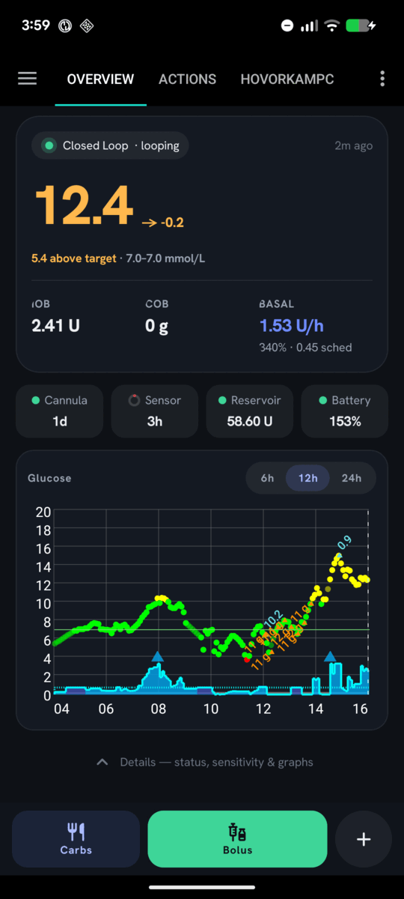 | 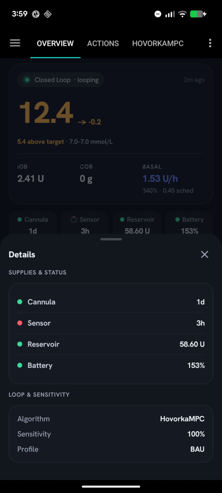 | 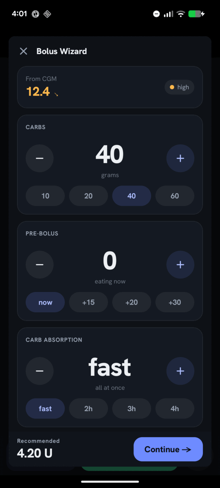 |
| **Home** — hero card, supplies, glucose graph | **Details** — supplies, loop & sensitivity | **Bolus wizard** — carbs, pre-bolus, absorption |
| 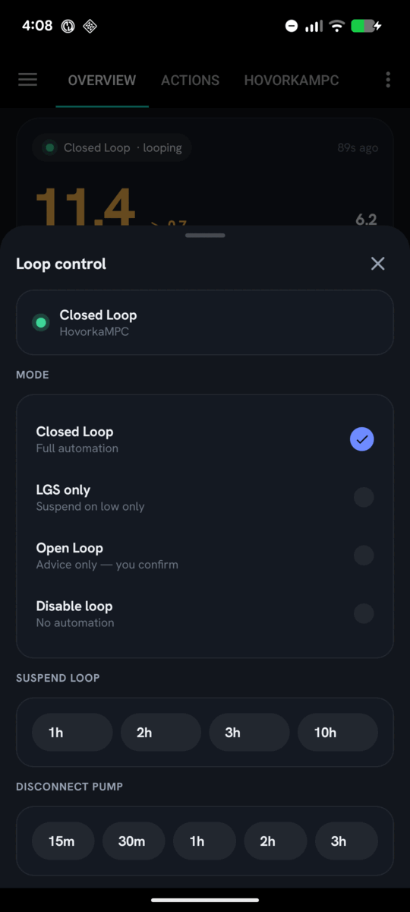 | 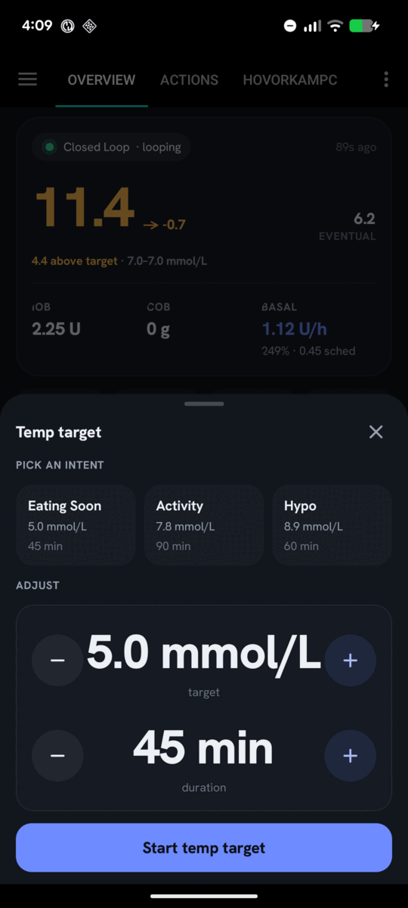 | 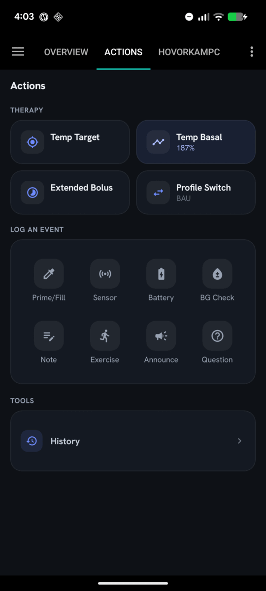 |
| **Loop control** — mode, suspend, disconnect | **Temp target** — intent presets, then adjust | **Actions** — therapy, event log, tools |
| 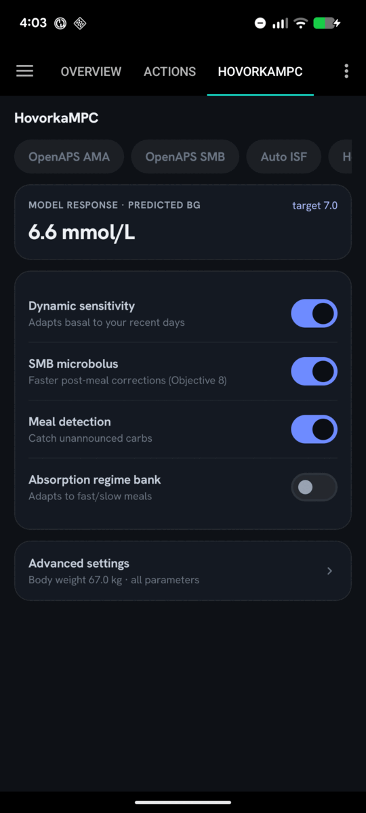 | 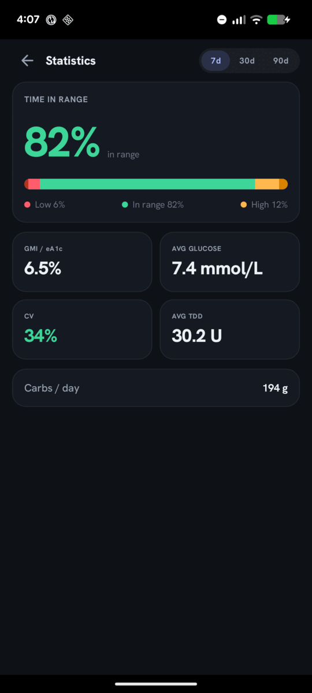 | 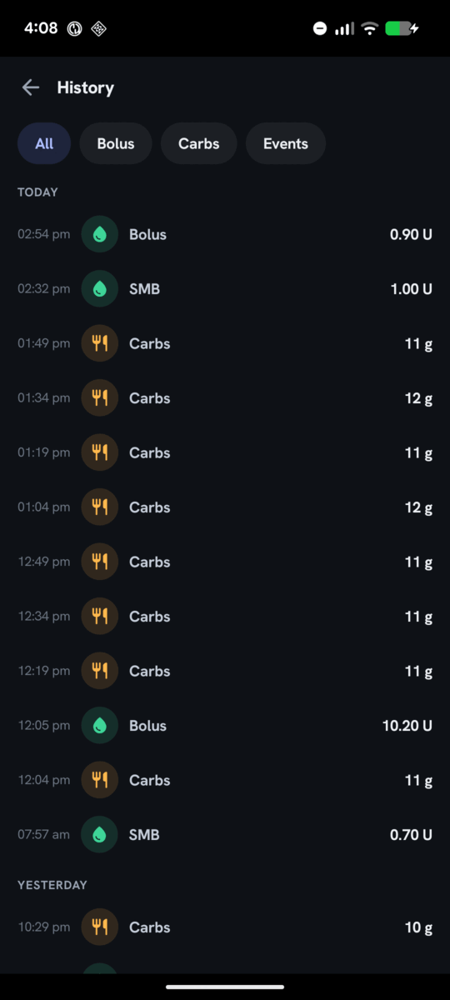 |
| **HovorkaMPC** — model response and its switches | **Statistics** — TIR, GMI, CV, TDD | **History** — unified, day-grouped timeline |
| 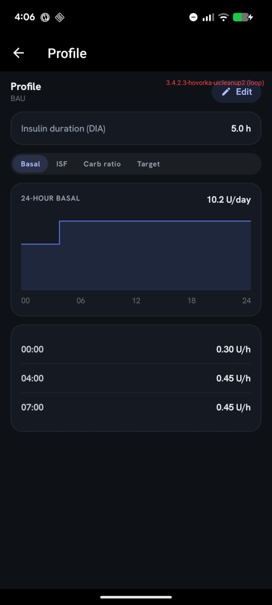 | 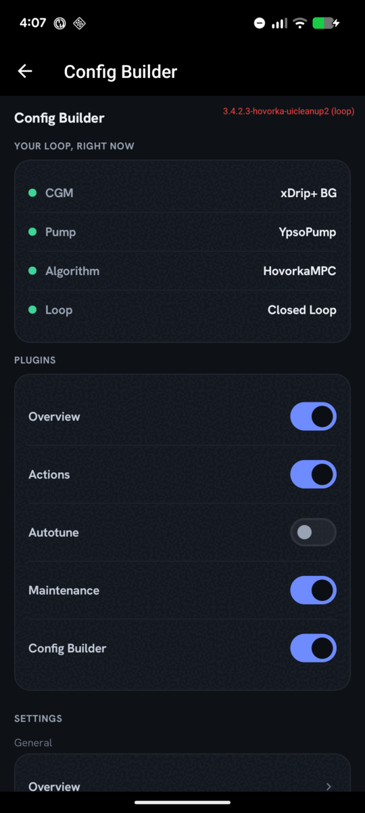 | |
| **Profile** — DIA, basal curve, ISF/IC/target | **Config Builder** — active loop, plugins, settings | |

The design is mmol/L-first, and the accent colour is reserved for "this is tappable" while greens,
ambers and reds mean glucose or loop state and nothing else.

### Skins

Every colour, the font and the corner radii resolve through one seam at runtime, so the look is data
rather than something compiled in. Changing it needs no rebuild.

| | |
|:---:|:---:|
| 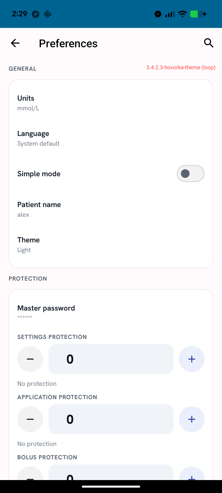 | 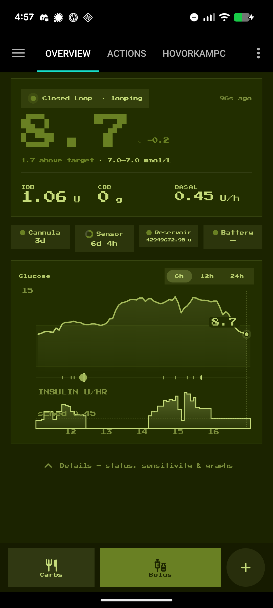 |
| **Light** — the built-in light ground | **Game Boy** — a skin file: one hue, square corners, 8-bit font |

**Choosing one.** Settings → General → **Theme**. The list is flat — *Follow system*, *Light*, *Dark*,
*Midnight*, then one entry per installed skin file. It is deliberately not two settings. A palette
picker plus a separate light/dark switch produces combinations that quietly do nothing (a dark-only
palette set to "light"), and most skins are a single look anyway. Changing skin repaints immediately;
changing light/dark still recreates the activities, because the app's remaining XML screens have no
other way to follow.

**Managing them.** Settings → **Skins**. Import a `.aapsskin` bundle, export one to send to someone,
remove one, or export a starter template seeded from the palette currently on screen.

**Writing one.** A `.aapsskin` file is a zip holding `skin.json` and, optionally, a `.ttf`. Every
colour is optional and inherits from the default skin, so a skin says only what it cares about — this
is the entire Game Boy skin above:

```json
{
  "formatVersion": 1,
  "id": "gameboy",
  "label": "Game Boy",
  "author": "alex",
  "cornerRadius": 0,
  "font": { "file": "dmg.ttf", "singleWeight": true, "scale": 0.6 },
  "dark": {
    "background": "#1B2300", "surface": "#222E00", "surface2": "#293800", "bar": "#161B00",
    "textPrimary": "#C5DB7A", "textSecondary": "#B5CA6B", "textTertiary": "#7B8E3C",
    "inRange": "#698023", "high": "#A4BA5B", "low": "#E8FD9A",
    "veryHigh": "#7DA300", "veryLow": "#FAFFE2",
    "accent": "#C5DB7A", "onAccent": "#1B2300"
  }
}
```

`cornerRadius` is one number for the whole shape language — `0` squares every corner including the
pills. The font above is Press Start 2P (SIL Open Font License); a bundle may carry its `LICENSE` or
`OFL.txt` alongside, which the importer keeps so the skin stays redistributable. Omitting `light` marks a single-look skin: it keeps its one palette whichever mode is set,
rather than reverting to the default light ground and losing its identity. Colour names match the
tokens in `core/compose/theme/Color.kt` one for one. `singleWeight` stops the type scale asking a one-weight font for bolds it cannot
draw, which would otherwise be synthesised and smear the edges a pixel font exists to keep sharp, and
`scale` compensates for a face far wider per character than the one the layouts were drawn against.

Numeric readouts set their unit much smaller than the number, and shrink to fit rather than
truncating. That is worth knowing when writing a skin: a pixel face is roughly twice the width per
character, and without it "0.45 U/h" renders as "0.45" — a dose readout quietly losing its unit while
still looking like a complete number.

**A skin has to be legible before it is allowed on screen.** This app decides insulin and the number
on the hero is the number you act on, so a palette is checked on import *and* on every load — the
rules can tighten in a later build, and a skin accepted under looser ones must not keep rendering.
Text clears WCAG 4.5:1 on every surface it appears on, status colours clear 3:1, and the glucose
bands must be at least ΔE 20 apart from each other. A rejected file says which token failed, what it
measured and what it needed. Built-in skins go through the identical code path, so they cannot hold
themselves to a lower bar than a file someone sends you.

That ΔE floor is perceptual distance, not a contrast ratio, because contrast answers the wrong
question here: amber and green sit at a ratio of 1.09 while being nothing alike. It looks at first as
though a single-hue palette cannot satisfy five bands at that distance and still be readable — the
Game Boy skin above was nearly the reason to lower it — but that turns out to be an artefact of
choosing grounds and inks first and fitting the bands into what is left. Solved together, one hue
clears the same floor with room to spare.

**Sharing** is file-based: export a bundle and send it however you like. There is no skin repository
yet.

**Not yet skinnable:** the app's remaining XML screens (the tab bar, the preference tree, the system
bars) follow the old `AppTheme`, so they stay dark-blue under any skin; and about thirty hard-coded
circular shapes — status dots, the "+" button — stay round whatever `cornerRadius` says. Spacing is
deliberately excluded: padding decides whether a dose stepper or a hold-to-confirm button can be hit,
which is not a knob to hand to a theme file.

---

## 5. Slim loop build

**`loop` build type in `buildSrc/`, plus removals across the module tree**

Upstream ships every pump driver, every algorithm and every integration, because upstream serves everyone.
This fork serves one pump and one algorithm, so it carries what it uses. Measured on device before and after:

| | Before | After |
|---|---|---|
| APK on disk | 189 MB | 67 MB |
| Dex files | 34 | 7 |
| `resources.arsc` | 10.2 MB | 1.2 MB |
| Native ABIs | 7 | 1 (`arm64-v8a`) |
| Dexopt state | `run-from-apk` | `speed` |
| Idle CPU, screen off | 4.72%* | 2.59% of a core |

\* The before figure is a 56-hour mixed foreground/background average rather than a matched screen-off
window, so treat that one pair as indicative. The protocol-matched measurement is 3.04% → 2.59% across the
legacy-overview change alone, over identical 15-minute screen-off windows.

### The `loop` build type

The important part is not the size. **Android refuses to ahead-of-time compile a `DEBUGGABLE` package** —
`cmd package compile -m speed` reports success and silently downgrades to `verify`, so a debug build runs
`status=run-from-apk` and JIT-compiles every dex file, forever.

The `loop` build type is the debug build with `isDebuggable = false`, **signed with the same debug
keystore**. That signing choice is deliberate and load-bearing: the signature still matches what is
installed, so `adb install -r` remains an *update* rather than a reinstall, `/data` survives, and the pump
driver keeps its session key. Give it a different `signingConfig` and every install becomes an uninstall.

```bash
./gradlew :app:assembleFullLoop
adb install -r app/build/outputs/apk/full/loop/app-full-loop.apk
adb shell cmd package compile -m speed -f info.nightscout.androidaps   # not automatic after install
adb shell cmd package dump info.nightscout.androidaps | grep -A3 'Dexopt state'   # want status=speed
```

Build `assembleFullDebug` instead when you need a debugger, and rebuild `loop` afterwards.

### What was removed

Twelve unused pump drivers and the RileyLink radio only Medtronic/Omnipod need (YpsoPump plus
Medtrum, virtual and `pump:common` are kept); Firebase Analytics,
Crashlytics and Remote Config (`FabricPrivacy` now logs to the AAPS log instead, so its call sites are
unchanged); LeakCanary; Wear support and fourteen bundled watchfaces; all locales but `en`; all ABIs but
`arm64-v8a`. `material-icons-extended` was 19.7 MB of dex to draw 33 icons — the 25 that only exist there
are vendored into `core/compose` as path data extracted from the library itself, so they render identically.

### Runtime changes

Only two touch behaviour, and neither is on the dosing path:

- **Graph work is gated on UI visibility.** Every CGM tick ran a 16-worker chain, of which 14 built
  overview graph series by querying the database — with the screen off, and with the dosing decision
  queued thirteenth. The chain now runs IOB/COB and the loop first, and prepares graph series only while
  a screen is visible; `OverviewFragment` rebuilds them on resume. Hidden cycles run 5 workers in under a
  second against 17 taking several.
- **The hidden legacy overview no longer runs or draws.** The Compose home is an opaque overlay over the
  original layout, which was still being fed ~120 values per refresh and redrawing its own graphs.

Plus: Nightscout upload/download failures back off and log one stack per distinct error rather than one per
record, and `deviceStatus` — write-only rows that existed to be uploaded — is kept for 7 days instead of 186.

---

## 6. Delivery the pump cannot make

**`pump/ypsopump/` (pre-flight, reservoir watch, recording rules) · `ui/.../dialogs/compose/PumpReadyGate.kt`
(the workflow) · `plugins/main/.../overview/` (the alert, the pill, the undo)**

Two failures that look nothing alike from the outside turn out to be the same bug: the app assumed the
pump was delivering, and had no idea what to do when it was not.

**A bolus into a stopped pump looked like it was working.** The wizard did its maths, the progress dialog
opened, and it sat at 0% until the driver's five-minute confirm window expired. The pump had refused the
very first write; nothing in the app knew, because the driver polled for the delivery regardless.

**A cartridge that ran dry produced no feedback at all.** There is no reservoir alert anywhere in
AndroidAPS — a pump that empties simply stops. Worse, the reservoir pill on the redesigned Home was drawn
only when the level was above zero, so it *vanished* at exactly the moment it mattered: an empty cartridge
rendered identically to a screen that had never shown one. The loop kept commanding basal and boluses into
a pump that could not take them, and because an unconfirmed bolus is deliberately recorded as delivered
(over-stating IOB is the safe side of that guess), it kept **booking insulin that did not exist**. The IOB
the loop was reasoning against was wrong for hours.

So:

- **Pre-flight before anything is queued.** Every route that delivers — wizard, manual bolus, insulin,
  prime/fill — checks the pump first. Stopped or empty, and you get a sheet that says which, with
  **Check again**: it reconnects, re-reads the pump, and delivers *the same dose* if it comes back
  healthy, so nothing has to be re-entered. There is no BLE command to restart a YpsoPump — starting a
  pump is a physical act, deliberately — so the honest workflow asks rather than pretends. A merely
  *suspended loop* is different: that is reversible from the sheet, and it is not a reason to refuse a
  meal bolus, so "Resume loop and bolus" and "Bolus anyway" are both offered.
- **The driver fails fast instead of polling a dead pump.** The BLE layer now distinguishes *never sent*
  from *sent* from *ack lost*. Only the first is a certain no-op, and only it skips confirmation — a lost
  ack can still mean the pump delivered, so that path confirms by read exactly as before. The stuck-at-0%
  dialog was never a UI bug: the progress dialog closes when `deliverTreatment` returns.
- **Reservoir surveillance.** Urgent alert below the critical threshold, alarm at empty — Home alert,
  Android notification and sound. The pill is drawn whenever the pump has been read, turns amber below
  the warning threshold and says **Empty** in red. Both thresholds are the app's *existing* reservoir
  preferences (Overview → status lights), which the redesign had left unread when it dropped the
  status-lights row — so this puts a setting that was already there, and already
  translated, back to work rather than inventing numbers nobody can find.
- **Empty is a suspended pump.** It reports as suspended, so the loop drops to `SUSPENDED_BY_PUMP`, and
  it records the same 0-rate `PUMP_SUSPEND` temp basal a pump-side stop does — which is what stops
  *basal* IOB accruing against insulin that never left the cartridge.
- **Never book a dose the pump was known not to take.** An unconfirmed bolus is still recorded when the
  pump is healthy, because under-counting IOB is the dangerous direction — but it now raises an urgent
  notification telling you to verify it. When a fresh status read shows the pump stopped or empty, that
  is not ambiguity, and nothing is recorded at all.
- **A way to repair IOB.** Tapping IOB opens the bolus/basal split and the last six hours of boluses,
  each removable behind a confirmation and the same audited `invalidateBolus` path the old Treatments
  screen used. Six hours is the point: it is longer than any sane DIA, so every dose still contributing
  to the IOB on screen is in that list.

---

## Smaller changes

Things that do not warrant a section but are still differences from upstream.

**Nightscout over a private network.** NSClient v3 is HTTPS-only at four separate gates — the URL
validator, the plugin's scheme handling, the `nssdk` request builder, and Android's own
`network_security_config`. The last is the quiet one: it fails with `UnknownServiceException: CLEARTEXT
... not permitted` and only in AAPS's internal log. All four are patched so a Nightscout on a Tailscale
or LAN address works. **For private networks only** — do not point this at anything reachable from the
internet over plain HTTP.

**Nightscout failure handling.** Upload and download failures back off (30 s doubling to 30 min) and log
one stack per distinct error instead of one per record. With the mesh down, the previous behaviour was
416 failures in three hours and 55% of every line the app wrote.

**Pump-driver reliability.** A BLE watchdog that unwedges stalled operations (the recurring "pump
unreachable"), a fix for delivered boluses being discarded by an AAPS one-minute freshness gate, bolus
under-recording corrected by decoding pump status and reconciling against pump history, and the pump's
own 28-day session-key expiry identified and surfaced (`0x8C NO_SHARED_KEY`) rather than presenting as a
generic connection failure.

---

## Building

Two variants matter:

```bash
./gradlew :app:assembleFullLoop     # the build that drives the pump — non-debuggable, AOT-eligible
./gradlew :app:assembleFullDebug    # debuggable, for attaching a debugger
```

Both are signed with the debug keystore, so `install -r` between them preserves app data.

If the build fails inside KSP with `PROCESSING_ERROR`, run `./gradlew :app:clean` first — the annotation
processor caches stale generated types across large refactors.

The YpsoPump driver reads its session key from device preferences at runtime. It is **never** committed to
this repository.

---

## Issues

Please **do not raise issues from this fork against upstream AndroidAPS**. None of the above is their work
and none of it has had their review. Upstream bugs belong at
[nightscout/AndroidAPS](https://github.com/nightscout/AndroidAPS/issues).

---

## Licence

AGPL-3.0, same as upstream AndroidAPS. See [LICENSE.txt](LICENSE.txt).

---

<sub>Everything below is the upstream AndroidAPS README, unchanged.</sub>

> ℹ️ **Fork change — NSClientv3 accepts `http://` Nightscout URLs.** Upstream AAPS is HTTPS-only for
> Nightscout sync, enforced at four independent layers: the URL input validator, the NSClientv3 plugin's
> scheme handling, the `nssdk` network builder, and the app's Android network-security config
> (`app/src/main/res/xml/network_security_config.xml`). This fork loosens all four so a plain-HTTP
> Nightscout can be used. **This is intended specifically for VPN / mesh setups (e.g. Tailscale,
> WireGuard, ZeroTier) where the transport is already end-to-end encrypted and TLS on Nightscout is
> redundant.** Cleartext is permitted only for the explicitly listed hosts in `network_security_config.xml`
> — everything else stays HTTPS-only. **Do not point NSClientv3 at a plain-HTTP endpoint over the public
> internet or an untrusted LAN**: your API token and health data would travel unencrypted. Add or remove
> allowed hosts by editing the `<domain>` entries in that file.

# AAPS
* Check the wiki: https://wiki.aaps.app
*  Everyone who’s been looping with AAPS needs to fill out the form after 3 days of looping  https://docs.google.com/forms/d/14KcMjlINPMJHVt28MDRupa4sz4DDIooI4SrW0P3HSN8/viewform?c=0&w=1

[](https://discord.gg/4fQUWHZ4Mw)

[](https://circleci.com/gh/nightscout/AndroidAPS/tree/master)
[](https://translations.aaps.app/project/androidaps)
[](https://wiki.aaps.app/en/latest/?badge=latest)
[](https://codecov.io/gh/nightscout/AndroidAPS)

DEV: 
[](https://circleci.com/gh/nightscout/AndroidAPS/tree/dev)
[](https://codecov.io/gh/nightscout/AndroidAPS/tree/dev)


3KawK8aQe48478s6fxJ8Ms6VTWkwjgr9f2
